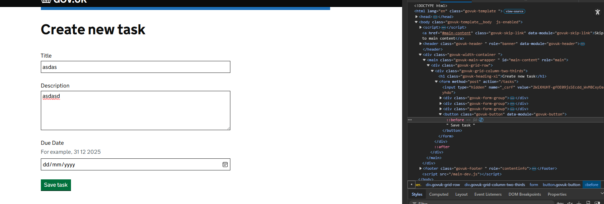

# HMCTS Dev Test Frontend

## Demo

### Dashboard

### Create Task

### Edit Task

### CSRF 

## Functional tests
1) `yarn playwright install`
2) `yarn start:dev`
3) `yarn test:functional`

## Setup
1) `yarn install`
2) `yarn webpack`
3) `yarn start:dev` or navigate to package.json and run the script manually
